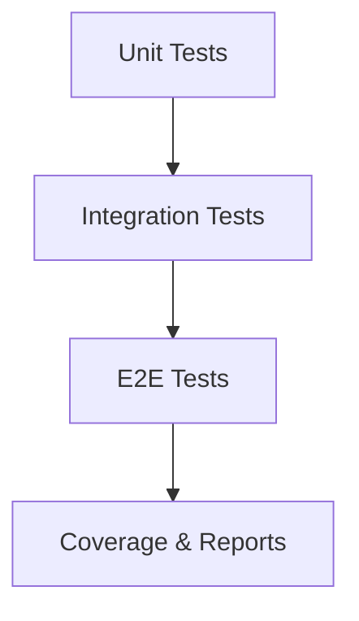
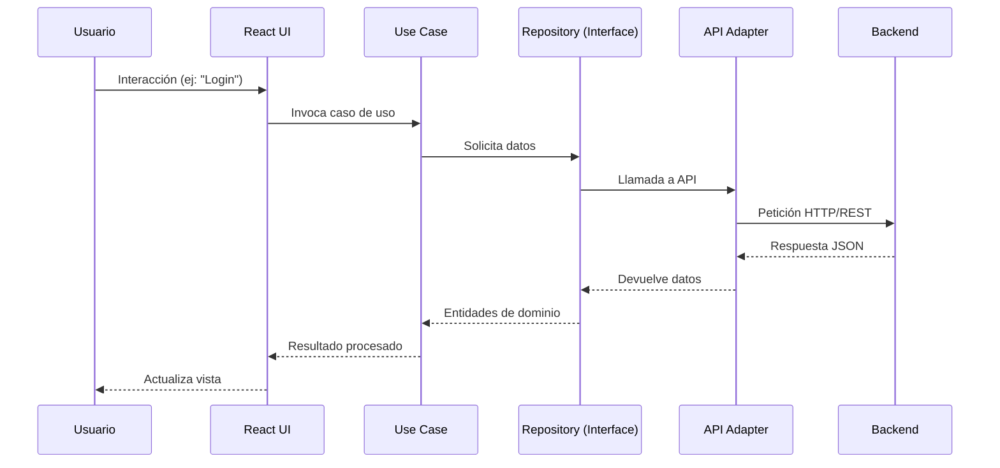

# Million Frontend

Frontend de la plataforma **Million**, desarrollado con **React + TypeScript + Vite**, bajo los principios de **Clean Architecture** y **SOLID**, asegurando escalabilidad, mantenibilidad y facilidad de pruebas.

---

## 📂 Estructura del Proyecto

```bash
/public
/src
  /api
  /components/Layout
  /features/properties
  /pages
  /styles
  /utils
```

Esta organización responde al enfoque de **Clean Architecture**, desacoplando la lógica de negocio de los frameworks o librerías.

---

## 📐 Diagrama de Arquitectura (Mermaid)

```mermaid
flowchart TD
  subgraph UI[Presentation Layer]
    A[React Components] --> B[State Management / Hooks]
  end

  subgraph App[Application Layer]
    B --> C[Use Cases]
  end

  subgraph Domain[Domain Layer]
    C --> D[Entities]
    C --> E[Interfaces (Repositories)]
  end

  subgraph Infra[Infrastructure Layer]
    E --> F[API Adapters / Repositories Impl]
    F --> G[External Services / REST API]
  end

  UI --> App
  App --> Domain
  Infra --> Domain
```

Este flujo asegura que la **dependencia siempre apunte hacia adentro**, protegiendo la lógica de negocio.

---

## 🛠️ Principios SOLID aplicados

| Principio | Implementación |
|-----------|----------------|
| **S**ingle Responsibility | Cada componente y clase tiene una única responsabilidad (ej: un `UserRepository` solo maneja persistencia de usuarios). |
| **O**pen/Closed | Nuevos casos de uso se agregan sin modificar los existentes, solo extendiendo interfaces. |
| **L**iskov Substitution | Repositorios falsos (mocks) pueden sustituir implementaciones reales sin romper el sistema. |
| **I**nterface Segregation | Interfaces pequeñas y específicas (ej: `AuthRepository`, `UserRepository`) en lugar de interfaces genéricas enormes. |
| **D**ependency Inversion | Casos de uso dependen de **interfaces** del dominio y no de implementaciones concretas. |

---

## ✅ Estrategia de Pruebas

Este proyecto aplica pruebas con **Jest** y **Testing Library** para garantizar la calidad.

- **Unitarias** → entidades, funciones puras y casos de uso.  
- **Integración** → interacción entre aplicación, presentación e infraestructura.  
- **End-to-End (E2E)** → flujos completos de usuario (cuando aplique, usando Cypress/Playwright).  

### Diagrama de Flujo de Pruebas



### Comandos de Pruebas

```bash
# Ejecutar todas las pruebas
npm test

# Modo watch
npm test -- --watch

# Reporte de cobertura
npm test -- --coverage
```

---

## 🏗️ Desarrollo Local

```bash
# Clonar repositorio
git clone https://github.com/imeshinnovation/million-frontend.git
cd million-frontend

# Instalar dependencias
npm install

# Levantar entorno de desarrollo
npm run dev

# Compilar para producción
npm run build

# Servir versión compilada
npm run preview
```

---

## 📊 Flujo de Datos (Clean Architecture)



---

## 📦 Buenas Prácticas Adoptadas

- **TypeScript** para tipado estático y reducción de errores.  
- **Linting** con ESLint y convenciones de commits (`conventional commits`).  
- **CI/CD Ready** → preparado para pipelines con integración continua.  
- **Inyección de dependencias** para mayor testabilidad.  
- **Código modular** con separación de responsabilidades.  

---

## 🤝 Contribuciones

1. Fork del repositorio  
2. Crear rama `feature/tu-feature`  
3. Commit con descripción clara  
4. Pull Request con detalle técnico  

---

## 📄 Licencia

Este proyecto está bajo la licencia **MIT**.  

---

## 👤 Autor

**Alexander Rubio Cáceres**  
📧 imesh.innovation@gmail.com | 📧 sigueme.android@gmail.com  
