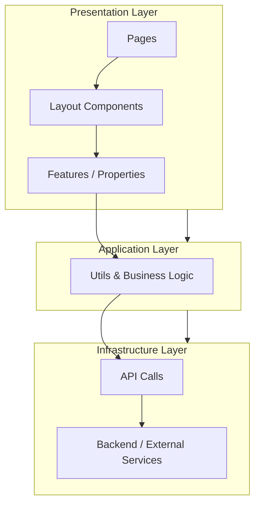
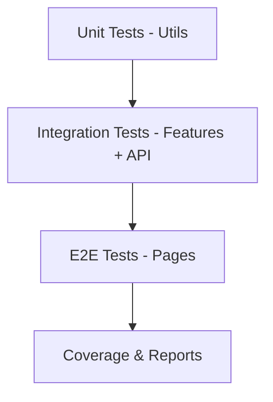
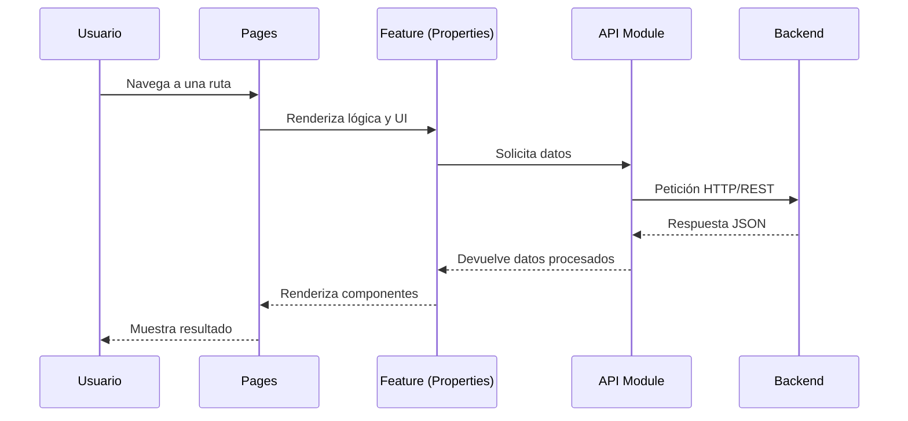
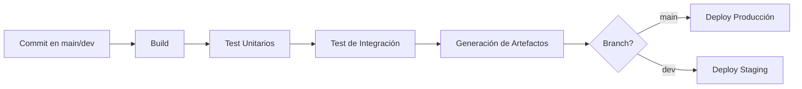

# Million Frontend

Frontend de la plataforma **Million**, desarrollado con **React + TypeScript + Vite**, bajo los principios de **Clean Architecture** y **SOLID**, asegurando escalabilidad, mantenibilidad y facilidad de pruebas.

---

## 📂 Estructura del Proyecto

```bash
/public
/src
  /api                 # Módulos de comunicación con el backend (fetch/axios)
  /components/Layout   # Componentes de diseño global (headers, footers, sidebars)
  /features/properties # Funcionalidades específicas de propiedades (vista, lógica)
  /pages               # Rutas principales de la aplicación (Next.js/React Router)
  /styles              # Estilos globales y modulares (CSS/SCSS)
  /utils               # Utilidades y helpers reutilizables
```

Esta organización permite mantener el proyecto modular, escalable y alineado con **Clean Architecture**, desacoplando la lógica de negocio de los frameworks o librerías.

---

## 📐 Diagrama de Arquitectura (Mermaid)



Este flujo asegura que la **dependencia siempre apunte hacia adentro**, protegiendo la lógica de negocio y garantizando bajo acoplamiento.

---

## 🛠️ Principios SOLID aplicados

| Principio | Implementación |
|-----------|----------------|
| **S**ingle Responsibility | Cada módulo tiene una responsabilidad única: `api` maneja peticiones HTTP, `features/properties` la lógica de propiedades, `Layout` la UI global. |
| **O**pen/Closed | Nuevas funcionalidades se agregan como `features` sin modificar módulos existentes. |
| **L**iskov Substitution | Los servicios de `api` pueden ser reemplazados por mocks en pruebas. |
| **I**nterface Segregation | Las utilidades (`utils`) se crean de forma modular para ser consumidas sin dependencias innecesarias. |
| **D**ependency Inversion | La lógica de negocio (`features`) depende de abstracciones (`utils` y `api`), no de implementaciones concretas. |

---

## ✅ Estrategia de Pruebas

El proyecto aplica pruebas con **Jest** y **React Testing Library**.

- **Unitarias** → funciones puras en `utils` y hooks.  
- **Integración** → interacción entre `features` y `api`.  
- **End-to-End (E2E)** → flujos de usuario en `pages`.  

### Diagrama de Flujo de Pruebas



### Comandos de Pruebas

```bash
# Ejecutar todas las pruebas
npm test

# Modo watch
npm test -- --watch

# Reporte de cobertura
npm test -- --coverage
```

---

## 🏗️ Desarrollo Local

```bash
# Clonar repositorio
git clone https://github.com/imeshinnovation/million-frontend.git
cd million-frontend

# Instalar dependencias
npm install

# Levantar entorno de desarrollo
npm run dev

# Compilar para producción
npm run build

# Servir versión compilada
npm run preview
```

---

## 📊 Flujo de Datos



---

## 🚀 CI/CD Workflow

El proyecto está preparado para integrarse con **pipelines de CI/CD** (ej: GitHub Actions, GitLab CI, Jenkins) para garantizar despliegues automáticos y confiables.

### Flujo CI/CD (Mermaid)



1. **Commit/PR** → dispara el pipeline.  
2. **Build** → compila con Vite/TypeScript.  
3. **Tests** → unitarios e integración con cobertura.  
4. **Artefactos** → empaquetado listo para despliegue.  
5. **Deploy** → staging o producción según rama.  

---

## 📦 Buenas Prácticas Adoptadas

- **TypeScript** para tipado estático y reducción de errores.  
- **Linting** con ESLint y convenciones de commits (`conventional commits`).  
- **CI/CD Ready** → preparado para pipelines con integración continua.  
- **Inyección de dependencias** para testabilidad en `api`.  
- **Arquitectura modular** → separación en `features`, `utils`, `api` y `layout`.  

---

## 🤝 Contribuciones

1. Fork del repositorio  
2. Crear rama `feature/tu-feature`  
3. Commit con descripción clara  
4. Pull Request con detalle técnico  

---

## 📄 Licencia

Este proyecto está bajo la licencia **MIT**.  

---

## 👤 Autor

**Alexander Rubio Cáceres**  
📧 imesh.innovation@gmail.com | 📧 sigueme.android@gmail.com  
